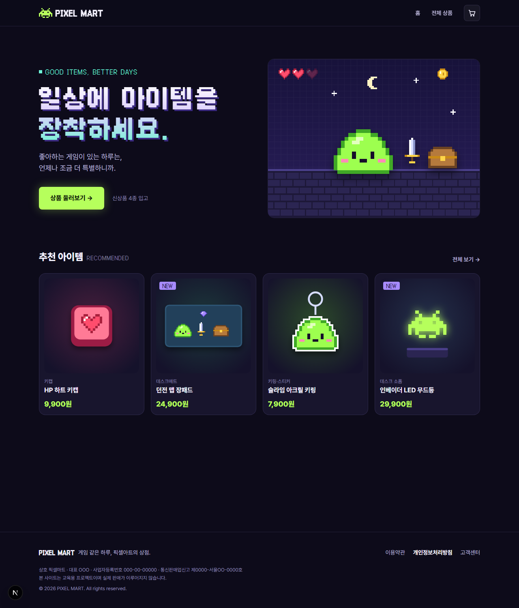
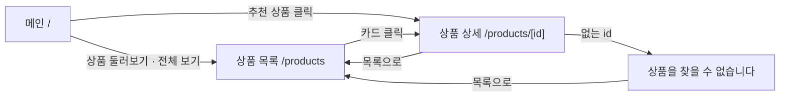
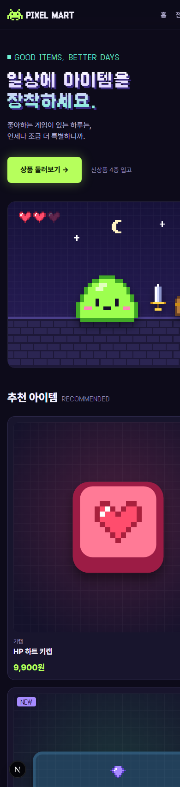

# 👾 PIXEL MART

> **일상에 아이템을 장착하세요.**
> 게임을 좋아하는 사람을 위한 픽셀아트 게이밍 데스크 소품 쇼핑몰



## 프로젝트 소개
| 항목 | 내용 |
| --- | --- |
| 팀명 | 더쿠하시조 (4인) |
| 기간 | 2026.10.07 ~ 2026.10.13 (4일, 10/13 발표) |
| Use Case | **디지털/IT 기기 샵** → 키캡 · 장패드 · 무드등 같은 게이밍 데스크 소품으로 변형 |
| 대상 | 게임을 좋아하는 20~30대, 책상을 꾸미고 싶은 사람(데스크테리어) |
| 콘셉트 | 다크 아케이드 · 8비트 픽셀아트 · 연두 네온 포인트 |

## 기술 스택
| 구분 | 사용 기술 |
| --- | --- |
| 프레임워크 | Next.js 16 (App Router, Turbopack) · React 19 |
| 언어 | TypeScript 5 |
| 스타일 | Tailwind CSS 4 (`@theme` 디자인 토큰) |
| 폰트 | Pretendard (본문) · Galmuri (픽셀 타이틀) |
| 협업 | Git · GitHub (GitHub Flow + Pull Request) · Notion |

## 실행 방법
Node.js LTS(v22 이상)가 필요합니다.
```bash
git clone https://github.com/KANT-2/pixel-mart.git
cd pixel-mart
npm install
npm run dev
```
브라우저에서 http://localhost:3000 접속

| 명령어 | 설명 |
| --- | --- |
| `npm run dev` | 개발 서버 실행 |
| `npm run build` | 프로덕션 빌드 (타입 검사 포함) |
| `npm run lint` | ESLint 검사 |

처음 합류한 팀원은 [docs/SETUP.md](docs/SETUP.md)를 따라 환경을 맞춰 주세요.

## 페이지 구성
| 경로 | 페이지 | 주요 내용 | 상태 |
| --- | --- | --- | --- |
| `/` | 메인 | 히어로 배너, 추천 상품 4개 | ✅ |
| `/products` | 상품 목록 | 카테고리 탭, 상품 그리드(한 페이지 12개), 페이지네이션 | 🔄 진행 중 |
| `/products/[id]` | 상품 상세 | 이미지, 카테고리, 이름, 가격, 설명, 장바구니 담기 | 🔄 진행 중 |
| `/products/[없는 id]` | 예외 처리 | "상품을 찾을 수 없습니다" 안내 + 목록으로 이동 | 🔄 진행 중 |

### 사용자 흐름


## 폴더 구조 · 컴포넌트 계층
```
pixel-mart/
├─ app/
│  ├─ layout.tsx              # 공통 레이아웃: Header + {children} + Footer
│  ├─ page.tsx                # 메인
│  ├─ globals.css             # Tailwind + 디자인 토큰(색상·폰트)
│  └─ products/
│     ├─ page.tsx             # 상품 목록
│     └─ [id]/page.tsx        # 상품 상세 (동적 라우트)
├─ components/
│  ├─ Header.tsx              # 로고 · 메뉴 · 장바구니 아이콘
│  ├─ Footer.tsx              # 정책 링크 · 사업자 정보
│  └─ ProductCard.tsx         # 상품 카드 (props: product)
├─ data/products.ts           # 상품 목데이터
├─ types/product.ts           # Product 인터페이스
├─ utils/formatPrice.ts       # 9900 → "9,900원"
├─ public/images/             # 상품·배너·로고 이미지
├─ tools/gen_images.py        # 픽셀아트 이미지 생성 스크립트
└─ docs/                      # 기획 · 협업 규칙 · 세팅 가이드 · 캡처
```

```
RootLayout (app/layout.tsx)
├─ Header
├─ main
│  ├─ Home (/)
│  │  ├─ 히어로 배너
│  │  └─ ProductCard × 4          ← products.filter(...).map()
│  ├─ ProductsPage (/products)
│  │  └─ ProductCard × N          ← products.map()
│  └─ ProductDetailPage (/products/[id])
│     └─ 상품 상세 / "상품을 찾을 수 없습니다"
└─ Footer
```

## 데이터 구조
```ts
// types/product.ts
export interface Product {
  id: number;          // 상품 고유 식별자
  name: string;        // 상품명
  price: number;       // 가격 (원)
  category: string;    // 카테고리
  imageUrl: string;    // 이미지 경로 (public 기준)
  description: string; // 상품 요약 설명
  isNew?: boolean;     // 신상품 여부
}
```
- 상품 데이터는 `data/products.ts`의 정적 배열(목데이터)만 사용합니다. 실제 DB·서버 연동은 하지 않습니다.
- 상품 이미지는 외부 링크 대신 `public/images/`에 직접 저장해, 링크 깨짐과 저작권 문제를 피했습니다.

## 팀원 및 역할
| 이름 | 역할 | 담당 |
| --- | --- | --- |
| ______ | 개발환경·데이터 / 컴포넌트·스타일 | 프로젝트 세팅, 목데이터, Header · Footer · ProductCard, 메인 페이지 |
| ______ | 기획·요구사항 / 디자인 | 콘셉트 · 범위 정의, 디자인 방향, 와이어프레임, 노션 |
| ______ | 라우팅·기능 | 상품 목록 · 상세 페이지, 예외 처리 |
| ______ | QA·문서화 | 빌드 점검, README, 화면 캡처 |

## 협업 규칙
- **GitHub Flow**: `main`에 직접 push하지 않고 `feat/*` · `fix/*` · `docs/*` 브랜치에서 작업 후 Pull Request로 머지
- 커밋 메시지: `feat: ProductCard 컴포넌트 추가` 형식
- 페이지 이동은 `next/link`의 `<Link>`만 사용
- 자세한 규칙: [docs/CONVENTIONS.md](docs/CONVENTIONS.md) · 기획 메모: [docs/PLANNING.md](docs/PLANNING.md)

## 화면 캡처
| 메인 (데스크톱) | 메인 (모바일) |
| --- | --- |
|  |  |

> 상품 목록 · 상세 화면 캡처는 구현 후 추가합니다.

## 트러블슈팅
| 문제 | 원인 | 해결 |
| --- | --- | --- |
| 상세 페이지 `params` 사용법이 강의와 다름 | Next.js 15부터 `params`가 Promise로 변경 | `const { id } = await params`로 사용 |
| 모바일에서 로고 · 메뉴가 두 줄로 꺾임 | 헤더 가로 공간 부족 | `whitespace-nowrap`, 모바일 여백 축소 |
| ESLint가 `` 사용을 경고 | Next.js는 `next/image`를 권장 | 과제 권장에 따라 `` 유지, 사유를 단 주석으로 처리 |

**이번 프로젝트 구현 범위**
## 핵심 서비스 기능

PIXEL MART는 단순한 레트로 굿즈 쇼핑몰이 아니라,
사용자가 자신의 취향을 발견하고 실제 사용 모습을 확인하며,
같은 취향의 사람들과 연결될 수 있는 취향 기반 커뮤니티 커머스를 지향합니다.

### 1. Deskterior Tournament

사용자가 자신이 꾸민 데스크를 공유하고,
다른 사용자가 투표해 토너먼트 방식으로 경쟁하는 기능입니다.

**기획 의도**
- 구매 이후에도 사용자가 다시 방문할 이유를 만듭니다.
- 사용자 데스크 자체를 새로운 상품 발견 콘텐츠로 활용합니다.

**기대효과**
- UGC 증가
- 체류시간 및 재방문 증가
- 데스크 사진에서 상품 상세로 자연스러운 구매 연결
- 지역 단위 Desk Tournament로 확장 가능

**이번 프로젝트 구현 범위**
- 샘플 데스크 UI
- 상품 태그 및 상세 페이지 연결
- 토너먼트 UI 프로토타입

---

### 2. Compatibility Preview

키보드 모델명과 상품 규격을 기준으로
키캡 호환 여부와 장착 예상 모습을 미리 확인하는 기능입니다.

**기획 의도**
- 구매 후 발생하는 규격 불일치 문제를 구매 전에 예방합니다.

**기대효과**
- 교환·반품률 감소
- CS 및 재배송 비용 감소
- 구매 불안 감소
- 구매전환율 개선

**이번 프로젝트 구현 범위**
- Mock 키보드 모델 데이터
- 호환/비호환 결과 UI
- 키캡 미리착샷 프로토타입

---

### 3. PIXEL LOCAL

지역과 취향을 기반으로 사용자가 같은 관심사를 가진 사람을 발견하고,
굿즈 거래·교환·커뮤니티 활동으로 연결되는 지역 기반 취향 커뮤니티입니다.

#### 주요 기능
- 덕력지도
- 지역별 팬 수 집계
- Local Trade & Exchange
- HAVE / WANT 교환 매칭
- Local Wish Map
- 지역 + 취향 + Deskterior 연결

**기획 의도**
- 상품 구매 목적이 없어도 사용자가 머물고 다시 방문할 이유를 만듭니다.
- 지역과 취향을 결합해 사용자 간 관계를 형성합니다.

**기대효과**
- 지역 팬덤 형성
- 커뮤니티 활성화
- 거래·교환 증가
- 지역별 취향 및 수요 데이터 확보
- 공동구매·지역 팝업·상품 소싱으로 확장 가능

**이번 프로젝트 구현 범위**
- Mock 지역 데이터
- 덕력지도 UI
- 지역 거래/교환 UI 프로토타입