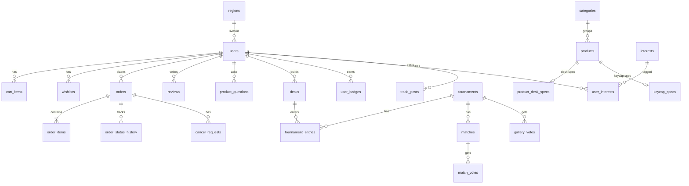

# DB 스키마 설계

> ✅ = 이미 만들어짐 (`0001_init`) / 나머지는 담당 트랙이 마이그레이션으로 추가합니다.
> 컬럼 이름은 snake_case, 모든 시간은 `timestamptz`.

## 전체 관계도

---

## 공통 (BE-A)
| 테이블 | 주요 컬럼 | 비고 |
| --- | --- | --- |
| **users** ✅ | id, email (unique), google_sub (unique), nickname, avatar_url, created_at | + BE-A가 추가: region_code FK, local_public bool |
| **categories** ✅ | slug PK, name (unique), description, sort_order | |
| **products** ✅ | id, name, price, category_slug FK, image_url, description, is_new, created_at | |
| cart_items | user_id FK, product_id FK, quantity, added_at · **PK(user_id, product_id)** | 수량 1~99 |
| wishlists | user_id FK, product_id FK, created_at · **PK(user_id, product_id)** | Local Wish Map 집계에도 사용 |

## 주문 · CS (BE-B)
| 테이블 | 주요 컬럼 | 비고 |
| --- | --- | --- |
| orders | id, user_id FK, status, total_price, recipient_name, address, created_at | status: `paid → preparing → shipping → delivered` / `cancel_requested → cancelled` |
| order_items | id, order_id FK, product_id FK, quantity, unit_price | 주문 시점 가격 저장 |
| order_status_history | id, order_id FK, status, changed_at | 배송 조회 타임라인 |
| cancel_requests | id, order_id FK, reason, status(`requested/approved/rejected`), created_at | |
| reviews | id, user_id FK, product_id FK, order_item_id FK, rating(1~5), content, created_at · unique(user_id, product_id) | 배송 완료 상품만 |
| product_questions | id, product_id FK, user_id FK, title, content, is_secret, answer, answered_at, created_at | 비밀글은 작성자만 열람 |
| faqs | id, category, question, answer, sort_order | 시드 데이터 |
| keyboards | id, maker, model, layout(`ANSI/ISO`), stem(`MX`…), profile_support text[], esc_size, spacebar_size, has_arrow_cluster | Mock 데이터 시드 |
| keycap_specs | product_id PK/FK, profile(`cherry`…), stem, key_sizes text[] (`1u`, `6.25u`, `arrows`, `accent4`) | 키캡 카테고리 30개 시드 |

## 커뮤니티 · 게임 (BE-C)
| 테이블 | 주요 컬럼 | 비고 |
| --- | --- | --- |
| product_desk_specs | product_id PK/FK, desk_type, desk_point(DP), desk_size(`fixed/small/medium/large`), allowed_zones text[] | 정책 문서 5·6·7·8장 값 |
| desks | id, user_id FK, title, items JSONB `[{productId, zone}]`, total_dp, created_at, updated_at | |
| tournaments | id, title, status(`entry/gallery/bracket/finished`), entry_ends_at, created_at | |
| tournament_entries | id, tournament_id FK, desk_id FK, user_id FK, items_snapshot JSONB, gallery_score, seed · unique(tournament_id, user_id) | 출품 시점 스냅샷 (투표 시작 후 수정 불가) |
| gallery_votes | tournament_id, voter_id, entry_id · PK(3개) | 1인 최대 3표 |
| matches | id, tournament_id FK, round(32/16/8/4/2), slot, entry_a_id, entry_b_id, winner_entry_id, status | |
| match_votes | match_id FK, voter_id FK, entry_id FK · PK(match_id, voter_id) | 본인 작품 투표 금지 |
| badges | code PK, name, description | `NEW_PLAYER`, `PIXEL_CHALLENGER`, `DESK_FIGHTER`, `DESK_MASTER`, `BOSS_CLEAR` … |
| user_badges | user_id FK, badge_code FK, awarded_at, meta JSONB · PK(user_id, badge_code) | |

## PIXEL LOCAL (BE-A, 3단계)
| 테이블 | 주요 컬럼 | 비고 |
| --- | --- | --- |
| regions | code PK, level(`sido/sigungu/zone`), parent_code FK, name | Mock 시드 — 시 › 구 › 동·생활권 Zone (예: 성남시 › 분당구 › 판교) |
| interests | id, type(`work/character/style/product_type`), name, parent_id | 작품 > 캐릭터 계층, 텍스트 태그만 |
| (users 추가 컬럼) | region_code FK, fandom_opt_in bool, profile_public bool, map_avatar_opt_in bool | 지역 집계 참여 · 취향 공개 · 덕력지도 아바타 표시 여부 (모두 기본 false) |
| user_interests | user_id FK, interest_id FK · PK | |
| trade_posts | id, user_id FK, region_code FK, kind(`have/want/sell`), product_id FK nullable, interest_id FK nullable, item_name, condition(`new/like_new/used`), price nullable, trade_method(`direct/delivery/both`), content, status(`open/done/hidden`), is_sample, created_at | 연락처·장소 기재 금지, 매칭은 item·interest + 지역 |
| fandom_samples | region_code, interest_id, count · PK(region_code, interest_id) | Cold Start용 Mock 집계 (응답에 `isSample`) |
| wish_samples | region_code, product_id, count · PK(region_code, product_id) | Wish Map Cold Start용 Mock 찜 집계 — 실제 찜이 없는 칸만 채움 (응답에 `isSample`) |
| gifts | sender_id·recipient_id FK users, trade_post_id FK(SET NULL), product_id, quantity 1~9, unit_price, message(100), status pending/accepted/declined, order_id FK(받는 사람 주문), created_at, responded_at | 동네 선물 (데모 결제, 서로 익명) |
| (집계) | `region_code × interest_id` **사용자 수**(중복 제거) — 5명 미만은 숫자 비공개, 상위 지역은 하위 합산 | 쿼리로 계산 |
